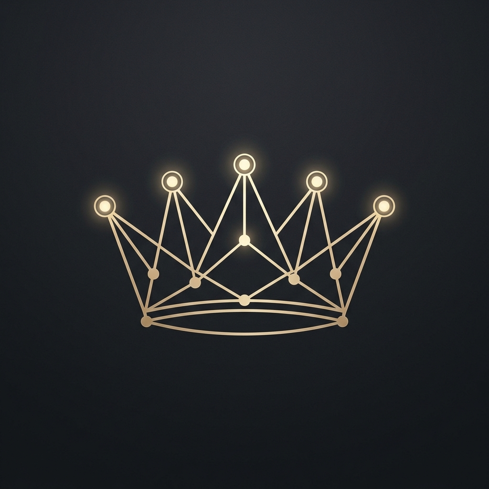
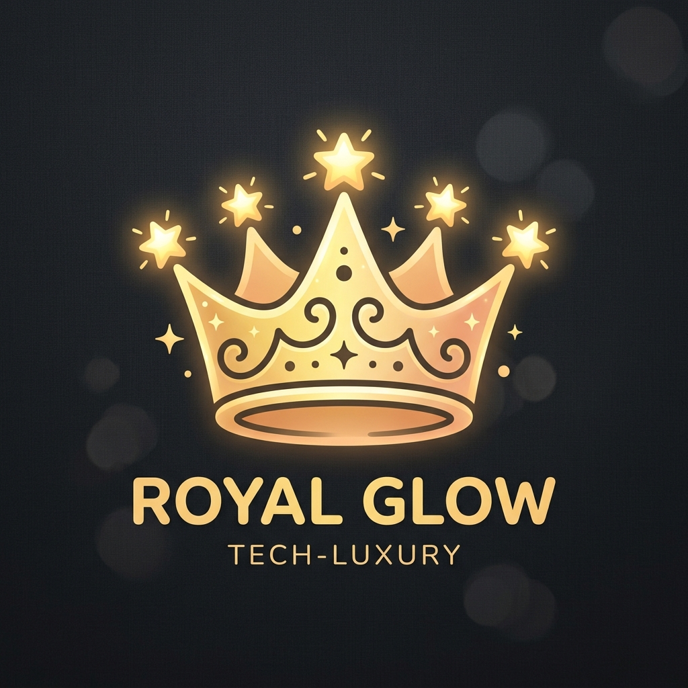
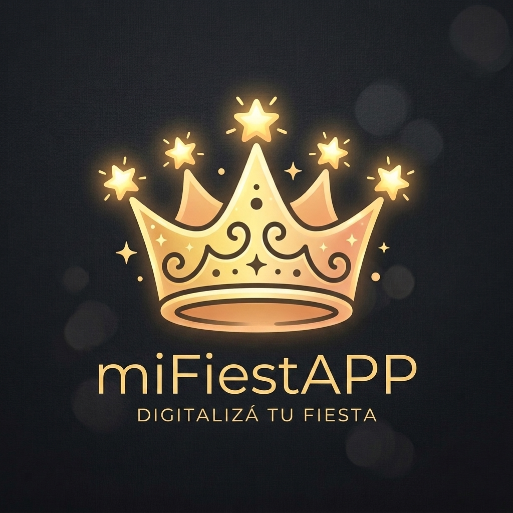
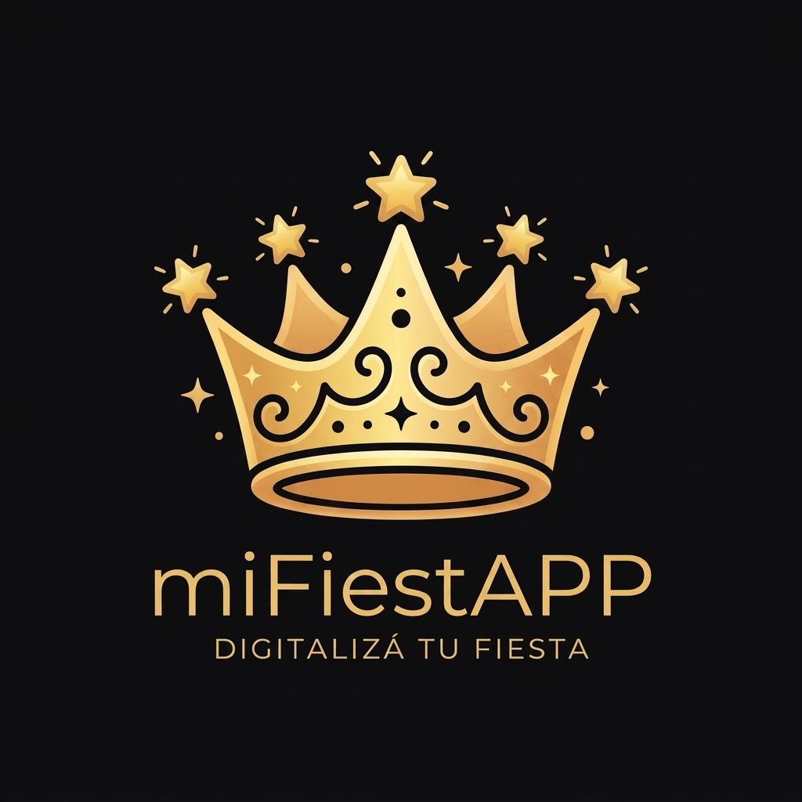

# miFiestAPP: Brand Identity, Concept & Logo Vision Book

Este documento sirve como la guía conceptual y creativa definitiva para la identidad de **miFiestAPP**, sintetizando qué es la plataforma, qué representa emocionalmente para los usuarios y qué metáforas visuales podemos utilizar para diseñar el logotipo definitivo.

---

## 🌟 1. ¿Qué es miFiestAPP? (La Misión)

**miFiestAPP** es una plataforma SaaS premium de entretenimiento, gestión y logística interactiva para eventos de alta gama (bodas, fiestas de 15 años, eventos corporativos, aniversarios). 

A diferencia de las invitaciones digitales estáticas tradicionales, miFiestAPP transforma la preparación y el transcurso de una fiesta en una **experiencia interactiva y cinemática en tiempo real** que conecta a los organizadores, los anfitriones y los invitados desde el primer día hasta el final del evento.

---

## 🛡️ 2. Los Tres Pilares de la Plataforma

El concepto de miFiestAPP se apoya sobre tres pilares fundamentales que deben verse reflejados en la seriedad, modernidad y dinamismo de su identidad visual:

```
                  ┌─────────────────────────────────┐
                  │           miFiestAPP            │
                  └───────────────┬─────────────────┘
                                  │
         ┌────────────────────────┼────────────────────────┐
         ▼                        ▼                        ▼
┌─────────────────┐      ┌─────────────────┐      ┌─────────────────┐
│  LA LOGÍSTICA   │      │ LA GAMIFICACIÓN │      │ LA EXPERIENCIA  │
│    ELEGANTE     │      │   EN VIVO       │      │   PREMIUM       │
│ RSVP, Mesas,    │      │ Trivia, Fotos,  │      │ Cinematográfica,│
│ Regalos, Música │      │ Capitanes       │      │ Dorados, Glases │
└─────────────────┘      └─────────────────┘      └─────────────────┘
```

1. **La Logística Elegante (Antes de la Fiesta)**:
   - Invitación inmersiva en formato móvil vertical (Zero-Scroll).
   - Confirmación de asistencia (RSVP) automatizada y trazable.
   - Organización de mesas e información interactiva (cofre de regalos deslizable, sugerencia de canciones).
   
2. **La Gamificación en Vivo (Durante la Fiesta)**:
   - **Trivia en Tiempo Real**: Los invitados juegan desde sus teléfonos respondiendo preguntas sobre los novios/homenajeados con marcadores y podios en vivo en la pantalla principal del salón.
   - **Capitanes de Mesa**: Un juego exclusivo de rol y capturas fotográficas. El administrador asigna un "Capitán" por mesa; este toma fotos de los desafíos en vivo y el resto de la tripulación observa las fotos en carruseles 3D proyectados en el salón.

3. **La Experiencia Premium & Tecnológica**:
   - Una interfaz que se siente costosa: efectos de glassmorphism, colores oscuros profundos, detalles dorados elegantes, transiciones fluidas de GSAP y Server-Sent Events (SSE) para sincronización en vivo.

---

## 🎭 3. Significado Emocional (¿Qué transmite?)

El logo debe evocar las sensaciones que experimentan los usuarios:
* **Prestigio y Exclusividad**: Es una fiesta de categoría, con atención al detalle.
* **Conexión Real**: Une a las personas en la mesa y en el salón a través del juego y la tecnología.
* **Celebración e Innovación**: Es el puente entre lo tradicional del festejo y el futuro digital.
* **Divertido pero Elegante**: No es un juego infantil; es entretenimiento de adultos sofisticado y tecnológico.

---

## 🎨 4. Paleta de Colores Recomendada

La identidad cromática del proyecto ya está muy bien definida en el código y debe trasladarse al logo:
* **Oro Jano's / Champagne (`#c5a059` / `#d4af37`)**: Representa la fiesta, el brillo, la corona del capitán, los podios de trivia y el prestigio.
* **Negro Obsidiana / Carbón (`#0a0a0c` / `#121215`)**: Representa la noche, la elegancia, la sobriedad y la tecnología (modo oscuro).
* **Blanco Titanio (`#ffffff`)**: Limpieza, legibilidad y contraste.

---

## 📐 5. Metáforas Visuales para el Logotipo

A la hora de diseñar el logo (isotipo + logotipo), se pueden explorar tres caminos conceptuales basados en los elementos del juego y la fiesta:

### Concepto A: "La Corona Conectada" (Prestigio + Red)
- **Idea**: La figura de una **corona de rey estilizada** (haciendo alusión directa a los *Capitanes de Mesa* y la victoria en la *Trivia*), pero integrada con nodos tecnológicos o líneas de conexión (que representan la red de invitados y la tecnología en tiempo real).
- **Estilo**: Líneas doradas minimalistas y continuas.
- **Ilustración del Concepto**:
  - Opción A1 (Geométrica / Tecnológica):
    
  - Opción A2 (Amigable / Fancy):
    
  - Opción A3 (Logotipo Definitivo):
    
  - Opción A4 (Logotipo Plano para Extracción):
    

### Concepto B: "El Destello Festivo & Código QR" (Celebración + Escaneo)
- **Idea**: La fusión de un **código QR abstracto** (el punto de entrada de todos los juegos) que en su centro o en uno de sus vértices se transforma en un **destello de luz o estrella de cuatro puntas** (celebración, brillo de la fiesta, magia).
- **Estilo**: Formas geométricas limpias con gradiente de dorado a champaña.

### Concepto C: "La F & La Copa de Brindis" (Inicial + Evento)
- **Idea**: Tomar las iniciales **M** y **F** (de miFiestAPP) y entrelazarlas geométricamente de manera que el espacio negativo o la silueta forme una **copa de brindis estilizada** o un **globo de diálogo/chat** (que representa la interacción social).
- **Estilo**: Monograma premium con tipografía de Serif (estilo *Cinzel* o *Bodoni*) refinado con bordes suaves.

---

## ✍️ 6. Tipografía Sugerida
* **Para el Isotipo/Logotipo**: Una tipografía **Serif moderna** o **Display** refinada (como *Cinzel* o *Playfair Display*) con mucho interletrado (tracking) para transmitir lujo y estabilidad.
* **Para el Subtexto ("APP" o "Eventos Interactivos")**: Una tipografía **Sans-Serif limpia** e industrial (como *Montserrat* o *Outfit*) en mayúsculas pequeñas.
